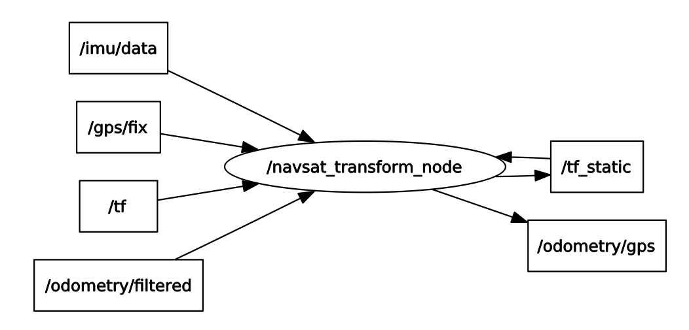

# navsat_transform_node.
## 功能:
融合多传感器,输出以odom为world frame的定位信息.

## IO_arch:

### 输入:
* /imu/data: 实时提供精确的航向角heading.
* /odometry/filtered: 里程计数据.ekf_localization_node或者ukf_localization_node输出.
* /gps/fix: gps数据.
* /tf:
* /tf_static [tf2_msgs/TFMessage]
### 输出:
* /odometry/gps [nav_msgs/Odometry]: 以odom为world frame的定位信息(可配)
* /tf_static [tf2_msgs/TFMessage]
### 服务:
* datum
